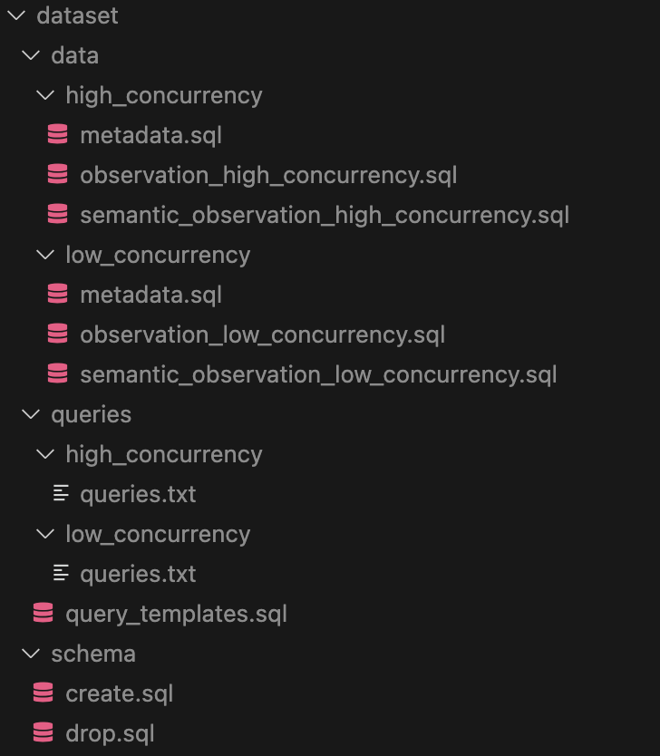

# CS223 Project 1 - Database Transaction Simulation

This application simulates execution of database transaction over a course of 20 days. 

## Usage
1. Running DBMS (`PostgresQL`)

   A postgresql instance must be running locally. To simplify the environment setup, a docker container can be started easily with `docker-compose`. 

   ```bash
   $ cd path_to_proj # Navigate to the code directory
   $ docker compose up -d
   $ docker compose logs -f
   ```
   The postgresql instance will now be available at `localhost:55432`. The username is `postgres`, the password is `example`, and the default database is `postgres`. 

2. Running the application

   1. This application assumes that the dataset is placed under a directory named `dataset` in the project's root directory, shown as follows: 
   
      
   
   
   2. Preprocess the SQL queries to sort with time order
   
   ```bash
   $ python preprocess.py
   ```

   3. Run the queries
   
   ```bash
   # Example execution that uses a transaction size of 14, a MPL of 100, and serializable consistency level, and runs the low concurrency dataset. 
   $ python main.py --size 14 --workers 100 --consistency-level 4 --metadata ./dataset-processed/metadata_low_concurrency.sql --queries ./dataset-processed/queries_low_concurrency.sql
   
   # Get help info
   $ python main.py --help 
   
   # Alternatively, run the automated test script with different MPL, transaction size and consistency levels. 
   # WARNING: This may take a long, long while on some machines. Up to more than 10 hours, to be specific. 
   $ sh run_test.sh 
   ```